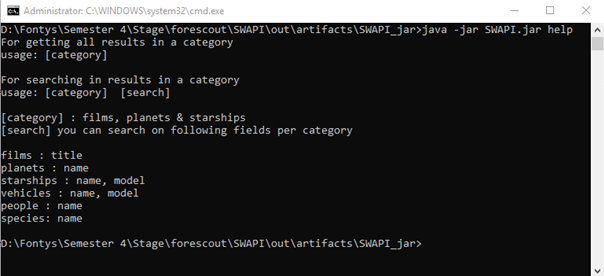

# StarWarsAPI
Java implementation of the SWAPI

Check https://swapi.co/ for the API documentation

Libaries used:
  GSON (Google's JSON lib)
  Appache httpclient and httpcore (making API requests)
  Junit (unit testing)

Console syntax

